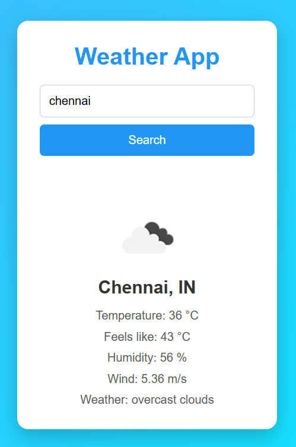

# Weather App

A simple, clean weather app that shows current weather details for any city using the OpenWeatherMap API.

## Features

- Search weather by city name
- Shows temperature, "feels like" temperature, humidity, and wind speed
- Displays weather condition with icon
- Search on button click or by pressing Enter
- Error handling for invalid city names or API issues
- Responsive, minimal UI

## Demo


*(Add a screenshot of your app here)*

## Tech Stack

- HTML
- CSS
- JavaScript (Vanilla)
- [OpenWeatherMap API](https://openweathermap.org/api)

## Getting Started

### 1. Clone the repository

```bash
git clone https://github.com/your-username/weather-app.git
cd weather-app
```

### 2. Get an API key

- Sign up at [OpenWeatherMap](https://home.openweathermap.org/users/sign_up)
- Get your free API key from the [API keys page](https://home.openweathermap.org/api_keys)

### 3. Add your API key

Create a file named `config.js` in the project root (this file is not committed to GitHub):

```js
const apiKey = "YOUR_API_KEY_HERE";
```

> ⚠️ Make sure `config.js` is added to `.gitignore` so your API key doesn't get pushed to GitHub.

### 4. Run the app

Simply open `index.html` in your browser — no build step or server required.

## Project Structure

```
weather-app/
├── index.html      # Markup
├── style.css       # Styling
├── script.js       # App logic (fetch, DOM updates)
├── config.js        # Your API key (not committed)
└── README.md
```

## How It Works

1. User enters a city name and clicks **Search** (or presses Enter)
2. The app calls the OpenWeatherMap API with the city name
3. On success, it displays the temperature, feels-like temperature, humidity, wind speed, weather description, and icon
4. On failure (invalid city, bad API key, network issue), an error message is shown

## License

This project is open source and available under the [MIT License](LICENSE).
